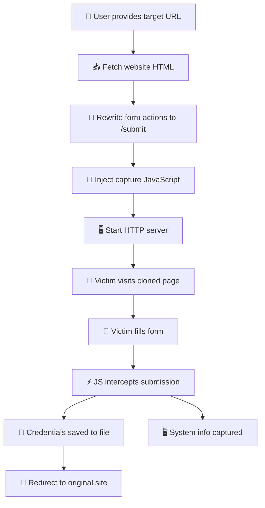

<div align="center">

```
   \                             /
    \                           /
     \                         /
      \       _-------_       /
    ---\_   /  O     O  \   _/<--- 
         \_|    _____    |_/
           |   | | | |   |
    ------ |   |_|_|_|   | ------
           |             |
          / \           / \
         /   \_________/   \
        /      /     \      \
       /      /       \      \
```

# 🔓 OPEN PENETRATION

### Web Cloning & Phishing Tool for Authorized Penetration Testing

[](https://www.python.org/)
[](https://www.kali.org/)
[](#)
[](#)

<br>

**⚡ Clone any website instantly • 🎯 Capture credentials • 🖥️ Profile target systems**

<br>

</div>

---

## 📋 Overview

**OPEN PENETRATION** is a lightweight, easy-to-use red-teaming tool designed for **security professionals** and **authorized penetration testers**. It allows you to rapidly clone any target website and spin up a local phishing server to capture submitted credentials and system information.

> ⚠️ **DISCLAIMER:** This tool is provided for **educational and authorized penetration testing purposes ONLY**. The developer is not responsible for any misuse, damage, or illegal activities caused by this software. **Use it responsibly!**

---

## ✨ Features

<table>
<tr>
<td width="50%">

### 🌐 Website Cloning
- ✅ Instant website cloning via URL
- ✅ Base URL tag (`<base href="...">`) injection for CSS/image asset loading
- ✅ Automatic HTML form rewriting
- ✅ JavaScript injection for capture
- ✅ Preserves page layout & styling

</td>
<td width="50%">

### 🔐 Credential Capture
- ✅ Intercepts all form inputs
- ✅ Captures email, password, & more
- ✅ Saves to `stolen_credentials.txt`
- ✅ Real-time terminal output

</td>
</tr>
<tr>
<td>

### 🖥️ System Profiling
- ✅ User-Agent detection
- ✅ Screen resolution capture
- ✅ Timezone & language logging
- ✅ Platform identification

</td>
<td>

### 🛡️ Safety & Config
- ✅ Lab mode toggle
- ✅ Tiered scope enforcement
- ✅ Graceful shutdown (Ctrl+C)
- ✅ Automated unit testing suite (`test_phish.py`)

</td>
</tr>
</table>

---

## 📁 Project Structure

```
open-penetration/
│
├── 📄 Phish.py              # 🔧 Main tool — core logic
├── 🧪 test_phish.py         # 🧪 Unit test suite
├── ⚙️ config.yaml           # 🎛️ Configuration file
├── 📦 requirements.txt      # 📚 Python dependencies
├── 🛠️ install.sh            # 🚀 Setup script
├── ▶️ run.sh                # 🏃 Launch script
├── 📖 README.md             # 📚 This file
│
├── 📂 <target-domain>/      # 🎯 Cloned site folder (auto-created)
│   ├── index.html           #    Cloned page
│   ├── stolen_credentials.txt  # 💀 Captured creds
│   └── system_info.txt      # 🖥️ Captured system info
│
└── 📁 .venv/                # 🐍 Virtual environment
```

---

## 🚀 Quick Start

### 1️⃣ Clone the Repository

```bash
git clone https://github.com/willygailo/open-penetration.git
cd open-penetration
```

### 2️⃣ Run the Installer

```bash
chmod +x install.sh run.sh
./install.sh
```

### 3️⃣ Launch the Tool

```bash
./run.sh -d https://target-website.com
```

### 4️⃣ Run Unit Tests

```bash
python3 -m unittest test_phish.py
```

🎉 **That's it!** The tool will clone the target and start the server.

---

## ⚙️ Configuration

Edit `config.yaml` to customize behavior:

```yaml
# 🔧 Lab Mode Toggle
lab_mode: true

# 🖥️ Server Configuration
server:
  host: "0.0.0.0"      # Bind address
  port: 8080            # Server port

# 🛡️ Scope & Authorization Control
allowed_domains:
  - "example.com"
  - "example.org"
  - "localhost"
  - "127.0.0.1"

# 🔐 Data Protection & Safety
data_protection:
  mask_credentials: true  # Mask sensitive fields (password, pin, secret) in log files

# ⚠️ Security Awareness Mode
awareness_mode:
  enabled: true
  custom_message: "This was a simulated security awareness exercise conducted by your IT Security team."

# 📝 Logging Configuration
logging:
  enabled: true
  log_file: "penetration.log"
  log_level: "INFO"     # DEBUG, INFO, WARNING, ERROR

# 🔐 Capture Configuration
capture:
  save_credentials: true
  save_system_info: true
  redirect_url: ""      # URL to redirect after capture (empty = no redirect)
```

### 🎚️ Tier System

| Tier | Name | Scope Enforcement |
|:----:|------|:-----------------:|
| 1 | 🔍 Reconnaissance | ⏭️ Skippable in lab mode |
| 2 | 🌐 Website Cloning | ⏭️ Skippable in lab mode |
| 3 | 🖥️ Server Operations | ⏭️ Skippable in lab mode |
| 4 | 🔐 Credential Capture | ⏭️ Skippable in lab mode |
| 5 | ⚠️ Critical Operations | 🔒 **Always enforced** |

---

## 📖 Usage

### Basic Usage

```bash
./run.sh -d https://example.com
```

### Custom Port

```bash
./run.sh -d https://example.com -p 9090
```

### Custom Config File

```bash
./run.sh -d https://example.com -c myconfig.yaml
```

### CLI Flags

| Flag | Description | Required |
|------|-------------|:--------:|
| `-d, --domain` | Target website URL to clone | ✅ |
| `-p, --port` | Server port (overrides config) | ❌ |
| `-c, --config` | Config file path | ❌ |

---

## 🧪 Unit Testing

Run the automated unit test suite to verify configuration loading, tier scope checks, and HTML DOM parsing:

```bash
python3 -m unittest test_phish.py
```

Expected output:
```
...
----------------------------------------------------------------------
Ran 3 tests in 0.029s

OK
```

---

## 🔄 How It Works



### Step-by-Step Flow

| Step | Action | Result |
|:----:|--------|--------|
| 1 | 🎯 Provide target URL | Tool fetches the website |
| 2 | 📥 HTML is cloned | Page saved locally |
| 3 | 💉 Scripts injected | Capture code added to page |
| 4 | 🖥️ Server starts | Listening on port 8080 |
| 5 | 👤 Victim visits page | Sees cloned website |
| 6 | 📝 Form submitted | Credentials intercepted |
| 7 | 💾 Data saved | `stolen_credentials.txt` updated |
| 8 | 🔄 Redirect | Victim sent to original site |

---

## 📊 Output Files

### 💀 stolen_credentials.txt

```
IP: 192.168.1.100
Time: 2025-01-15 14:32:05
email: victim@gmail.com
password: secretpass123
_trigger: form_submit
========================================
```

### 🖥️ system_info.txt

```
IP: 192.168.1.100
Time: 2025-01-15 14:32:04
User-Agent: Mozilla/5.0 (Windows NT 10.0; Win64; x64)...
Screen Resolution: 1920x1080
Timezone: America/New_York
Language: en-US
Platform: Win32
========================================
```

---

## 🛡️ Safety Features

| Feature | Description |
|---------|-------------|
| 🔒 **Lab Mode** | Disable all warnings for isolated environments |
| 🎚️ **Tier System** | Granular scope enforcement per operation |
| 🛡️ **Scope Whitelist** | Restrict cloning operations to authorized domains (`allowed_domains`) |
| 🔐 **Data Masking** | Protect cleartext passwords in logs (`data_protection.mask_credentials`) |
| ⚠️ **Security Awareness Mode** | Display interactive educational notice after form submission (`awareness_mode`) |
| 📝 **Logging** | Full activity log with timestamps |
| 🛑 **Graceful Shutdown** | Clean server stop with Ctrl+C |
| ⚠️ **Authorization Checks** | Confirm before sensitive operations |

---

## 📋 Prerequisites

- 🖥️ **Operating System:** Kali Linux (tested)
- 🐍 **Python:** 3.13 or higher
- 📦 **Dependencies:** `python3-venv` (installed automatically)

---

## 🛠️ Troubleshooting

<details>
<summary><b>❌ "ImportError: Failed to import test module: test_phish"</b></summary>

Make sure you are inside the repository directory (`cd WEB-OPEN-PENETRATIOn`) before running `python3 -m unittest test_phish.py`.
</details>

<details>
<summary><b>❌ "Config file not found"</b></summary>

The tool will use default configuration. Create `config.yaml` or specify a custom path with `-c`.
</details>

<details>
<summary><b>❌ "Cannot bind to port"</b></summary>

Port 8080 is already in use. Change the port in `config.yaml` or use `-p 9090`.
</details>

<details>
<summary><b>❌ "Failed to clone website"</b></summary>

Check your internet connection and verify the target URL is accessible.
</details>

<details>
<summary><b>❌ Credentials not saving</b></summary>

Ensure `lab_mode: true` in `config.yaml` and check file permissions.
</details>

---

## 📜 License

This project is provided for **educational and authorized penetration testing purposes only**.

---

## 👨‍💻 Developer

<div align="center">

**WILLY JR. CARNASA GAILO**

🛡️ Cybersecurity Enthusiast & Developer
🔧 Passionate about building robust security tools

[](https://web.facebook.com/https.willy.jr.carnasa.gailo2026.2027)
[](https://t.me/ANDI_U1)

</div>

---

<div align="center">

*"Security is not a product, but a process."*

⭐ **Star this repo if you found it useful!** ⭐

</div>
